# Implementation Plan — CMS for Any Organization (Plan v2, Phases 14–21)

> **Context:** Phases 1–13 (see `PHASE_*_COMPLETE.md`) made *admin-side terminology*
> configurable. This plan extends that to the **public-facing site** and modernizes
> its motion design.

---

## Problem Statement

Four gaps still hard-code the product to one organization type:

1. **URLs don't follow labels.** Renaming Customers → Clients leaves the route at
   `/customer`. Same on the client site: `/our-projects` stays even when the
   entity is "Menu".
2. **Client-facing page bodies are hardcoded.** Section eyebrows/headings/
   Subheadings ("Our Services", "What We Do Best", "Meet the Geniuses"), the
   Products cards, and CTA button labels are literals inside components. Only the
   navbar is DB-driven (`WebsiteHeader.menuItems`).
3. **Every client page has its own bespoke hardcoded hero.** `home`,
   `our-services`, and `teams` each define a private `Hero()` / `HeroSection()`.
4. **Interactions feel dated.** Services use a 3D flip card that fires on every
   hover; team cards are a plain `translate-y` lift; the logo strip uses a
   hand-rolled duplicated-div CSS scroll.

**Scope:** make the public-facing site as configurable as the admin panel already
is, and modernize its motion design.

---

## Requirements

| # | Requirement | Acceptance |
|---|---|---|
| R1 | Admin can edit all static landing-page text | No literal copy left in `app/(user)/home/page.tsx` or `Landing*Section` headers |
| R2 | Admin can manage repeatable card sections (e.g. Products) | Add/edit/reorder/delete cards without code |
| R3 | Every client page has a configurable hero | One reusable hero system, multiple layout variants |
| R4 | URLs reflect configured terminology | `/clients`, `/menu` etc., with old URLs still resolving |
| R5 | Client-facing headings use dynamic entity labels | Public site respects Settings > Labels |
| R6 | Modern, non-gimmicky motion | Scroll reveal + spring hover; no perpetual flip; respects `prefers-reduced-motion` |
| R7 | Team members shown attractively | Hover reveal + shared-element transition into detail modal |
| R8 | Zero breakage for existing installs | Every new content read falls back to today's hardcoded copy |

---

## Background & Reference Architectures

The two hard problems here are solved problems — worth copying rather than inventing.

**Structured page content.** Payload CMS **Globals + Blocks**, Strapi **Single Types
+ Dynamic Zones**, and Sanity **section arrays** all converge on the same shape: a
small set of *named sections*, each with a *typed data payload*, ordered and
toggleable. We model that with a single `SiteContent` table keyed by
`(pageKey, sectionKey)` holding a validated JSON payload. This codebase already
uses that convention (`WebsiteHeader.menuItems`, `FooterSetting.linkColumns` are
`Json` columns), so it fits existing patterns instead of fighting them.

**Route aliasing.** `next-intl`'s `pathnames` config is the canonical Next.js
pattern: physical route files stay fixed, and middleware rewrites a
*public-facing slug* onto the canonical path, with a redirect the other way so
there is exactly one indexable URL. Shopify and Webflow expose the same idea as an
editable "URL handle". We apply it to module slugs rather than locales.

**Motion.** Framer Motion `whileInView` + `staggerChildren` for entrance, spring
`whileHover` for lift, and `layoutId` for shared-element morphs (card image →
modal image). Card treatments follow current Aceternity / Magic UI conventions:
gradient glow border, pointer-tracked 3D tilt, and content-slide-up-over-image —
all of which read as modern without a full card flip.

---

## Proposed Solution

### Architecture

```mermaid
graph TD
  subgraph DB
    SC[SiteContent<br/>pageKey+sectionKey → Json]
    MR[ModuleRoute<br/>moduleKey → adminSlug/publicSlug]
    LO[LabelOverride<br/>existing]
  end

  SC --> CA[app/actions/site-content.ts<br/>cached reads, zod-validated writes]
  MR --> RA[lib/routes.ts<br/>moduleHref / resolveSlug]
  LO --> PL[PublicLabelProvider]

  CA --> SH[SectionHeader / PageHero / CardGrid]
  RA --> PX[proxy.ts middleware<br/>rewrite + canonical redirect]
  RA --> LNK[Sidebar & LandingNavbar hrefs]

  SH --> UP[app/&#40;user&#41; pages]
  PL --> UP
  PX --> UP

  ED[Website Setup > Landing Page editor] --> CA
  ED2[Settings > Routes editor] --> MR
```



### Data model additions

```prisma
model SiteContent {
  id         String   @id @default(cuid())
  pageKey    String   // "home" | "services" | "projects" | "teams" | ...
  sectionKey String   // "hero" | "products" | "services" | "team" | "faq" | ...
  variant    String   @default("default")
  isVisible  Boolean  @default(true)
  order      Int      @default(0)
  data       Json     // shape validated per sectionKey via zod
  updatedAt  DateTime @updatedAt

  @@unique([pageKey, sectionKey])
  @@index([pageKey, isVisible, order])
  @@map("site_content")
}

model ModuleRoute {
  id         String   @id @default(cuid())
  moduleKey  String   @unique  // "customer", "project", ...
  adminSlug  String   @unique  // "clients"
  publicSlug String   @unique  // "our-clients"
  updatedAt  DateTime @updatedAt

  @@map("module_routes")
}
```

Both are purely additive. Every consumer falls back to today's hardcoded values
when a row is absent, so an un-seeded install renders identically to now.

### Design decisions (locked)

| Decision | Choice | Rationale |
|---|---|---|
| Landing content model | **Fixed sections**, order/visibility configurable | Predictable, matches Strapi Single Types, far less effort than a block builder, harder to produce an ugly page |
| Public slugs | **Auto-derived from labels, with optional override** | `Clients` → `/clients` with no setup; override only when needed |
| Motion intensity | **Restrained** — scroll reveal, spring hover, shared-element modal | Ages well, stays fast, avoids the flashy-but-dated trap |

### Phase ordering rationale

Smallest and most self-contained first, riskiest last.

| Phase | Theme | Size | Risk |
|---|---|---|---|
| 14 | Motion primitives + card redesign | S | Low — visual only |
| 15 | Team showcase redesign | S | Low |
| 16 | `SiteContent` foundation | M | Low — additive |
| 17 | Landing Page editor (admin) | M/L | Medium |
| 18 | Universal hero system | M/L | Medium |
| 19 | Public dynamic terminology | M | Medium |
| 20 | Dynamic route slugs | L | **High** — spike first |
| 21 | QA, tests, docs, migration | M | Low |

---

## Task Breakdown

### Phase 14 — Motion Primitives & Card Redesign

**Task 1: Build reusable motion primitives**
Create `lib/motion/variants.ts` (shared `fadeUp`, `stagger`, spring presets) and
`components/motion/{RevealOnScroll,StaggerGrid,MotionCard,Marquee}.tsx` using the
already-installed framer-motion. `MotionCard` supports opt-in `glow` (gradient
border) and `tilt` (pointer-tracked `rotateX/rotateY` via `useMotionValue`). Every
primitive short-circuits to a plain element when `useReducedMotion()` is true.
*Test:* unit-test that variants resolve to unanimated values under reduced motion.
*Demo:* a staggered grid of cards fades up on scroll and spring-lifts on hover.

**Task 2: Replace the services flip card**
Rework `LandingServicesSection` cards: image zooms `scale(1.06)` on hover, a
gradient scrim + description + "Learn More" slides up over it, card lifts on
spring. Remove `[transform:rotateY(180deg)]`, `perspective`,
`backface-visibility`, and the `flippedIds` state entirely. On mobile, tap opens
`ServiceDetailModal` directly instead of flipping.
*Test:* assert `flippedIds` and all flip classes are gone; modal still opens on tap.
*Demo:* hovering a service card slides its description up over the image — no flip.

**Task 3: Apply scroll reveal across landing sections**
Wrap the grids/rows in `LandingFeaturedProjects`, `LandingBlogSection`,
`LandingPartnersSection`, and the Products section in `StaggerGrid` +
`RevealOnScroll`. Keep each card's existing markup — wrapper-only change.
*Demo:* scrolling the landing page staggers each section's cards into view once.

**Task 4: Replace the CSS logo scroller with `Marquee`**
Swap `LandingTechSection`'s duplicated-div `tech-scroll` hack for the `Marquee`
primitive (pause-on-hover, seamless loop, reduced-motion → static grid). Remove the
now-unused `tech-scroll` keyframes from `globals.css` after confirming nothing else
references them.
*Demo:* logo strip loops smoothly, pauses on hover, freezes under reduced motion.

---

### Phase 15 — Team Showcase Redesign

**Task 5: Redesign the team card**
New `components/TeamCard.tsx`: portrait with `grayscale → color` on hover, gradient
overlay, name/role sliding up, social icons staggering in. Used by both
`LandingTeamSection` and `app/(user)/teams`.
*Demo:* one card component renders identically in both places.

**Task 6: Shared-element transition into the member modal**
Give `TeamCard`'s image and `TeamMemberModal`'s image a matching framer-motion
`layoutId` so the portrait morphs into the modal instead of the modal popping in.
*Demo:* clicking a member animates their photo into the modal and back on close.

**Task 7: Upgrade the landing team rail**
Replace the manual `scrollBy` chevrons with a draggable, snap-scrolling rail
(chevrons retained as an affordance; auto-advance optional and paused on
hover/focus).
*Demo:* the rail can be dragged, snaps to cards, and stays keyboard-navigable.

**Task 8: Department grouping on the full team page**
`app/(user)/teams` groups members under their configured `Department`, with group
headings pulled from the Department list (Phase 9) rather than a hardcoded `title`.
*Demo:* adding a department in Settings creates a new labelled group publicly.

---

### Phase 16 — `SiteContent` Foundation

**Task 9: Schema + migration**
Add the `SiteContent` model, run the migration, and extend `prisma/seed-config.ts`
to seed one row per known `(pageKey, sectionKey)` using **exactly today's hardcoded
copy** — so seeding is visually a no-op.
*Test:* seed twice; assert idempotency and no duplicate rows.
*Demo:* `npm run seed-config` populates `site_content`; the site looks unchanged.

**Task 10: Zod schemas per section type**
`lib/content/schemas.ts` exporting `heroSchema`, `sectionHeaderSchema`,
`cardsSchema`, plus a `SECTION_REGISTRY` mapping each `sectionKey` to its schema,
human label, and default payload. This registry is the single source of truth the
editor UI renders from.
*Test:* every registry entry's default payload parses against its own schema.
*Demo:* invalid payloads are rejected with a field-level message.

**Task 11: Cached read/write server actions**
`app/actions/site-content.ts` — `getPageContent(pageKey)`, `getSection(...)`,
`saveSection(...)` (zod-validated), `toggleSection`, `reorderSections`. Reads
wrapped in `unstable_cache` tagged `site-content`, invalidated via `updateTag` on
write — same pattern as `getEntityLabels` (Phase 13) and `getDepartments`.
*Test:* saving invalidates the cache; malformed payloads rejected before the DB.
*Demo:* edits reflect immediately; repeat page loads issue no extra queries.

**Task 12: `SectionHeader` component with fallbacks**
`components/content/SectionHeader.tsx` takes `pageKey`, `sectionKey`, and a
`fallback`. Refactor `LandingServicesSection`, `LandingFeaturedProjects`,
`LandingBlogSection`, `LandingTeamSection`, `LandingPartnersSection`,
`LandingTechSection`, and `FaqSection` to use it, passing current literals as the
fallback.
*Test:* with no DB row, output matches the previous hardcoded markup.
*Demo:* changing a heading in the DB updates the section; deleting the row restores it.

---

### Phase 17 — Landing Page Editor

**Task 13: Editor shell under Website Setup**
New route `app/(app)/website-setup/landing-page` listing every `home` section as a
reorderable, toggleable row (drag handle, visibility switch, "Edit"), driven by
`SECTION_REGISTRY`. Add the nav entry to `components/Sidebar.tsx`.
*Demo:* the admin reorders and hides/shows landing sections, reflected on `/home`.

**Task 14: Section editors**
A `SectionEditor` rendering the right form from the registry: text inputs for
eyebrow/heading/Subheading, CTA label+href pairs, and `ImageUploader` where the
schema declares an image. Reuse the sticky-header + Save/Cancel pattern from the
existing Settings pages for consistency.
*Test:* required fields block save; a bad CTA URL is flagged.
*Demo:* editing "What We Do Best" → "Our Menu" changes the live services heading.

**Task 15: Repeatable card manager**
For `cardsSchema` sections (Products, and future card grids): add/edit/reorder/
delete cards with title, description, optional icon, image, and link. Delete the
hardcoded Products array from `app/(user)/home/page.tsx` and render from content.
*Test:* reordering persists; deleting the last card hides the section rather than
rendering an empty grid.
*Demo:* a café admin replaces the three IT "Products" cards with menu categories.

---

### Phase 18 — Universal Hero System

**Task 16: `PageHero` component with layout variants**
`components/content/PageHero.tsx` consuming `heroSchema`, with variants `split`
(current home), `centered`, `minimal`, and `stats` (the `our-services` pattern).
Supports per-line heading highlight so "Build Smarter" keeps its accent colour,
plus primary/secondary CTAs, image, and an optional stats row.
*Test:* each variant renders required fields and omits absent optional ones.
*Demo:* the same hero data renders in four distinct layouts via one field.

**Task 17: Migrate existing heroes**
Replace the private `Hero()` in `app/(user)/home/page.tsx` and `HeroSection()` in
`app/(user)/our-services/page.tsx` with `<PageHero pageKey=... fallback=... />`, and
add heroes to `teams`, `blogs`, `career`, `contact`, `about-us`. Seed each with its
current copy (or a sensible default where none existed).
*Test:* home and services heroes are visually equivalent pre/post migration.
*Demo:* every public page has a hero, all editable from one place.

**Task 18: Hero editor with live preview**
Extend the editor to cover heroes across all pages (page selector, since heroes are
not home-only), including a variant picker and a scaled live preview beside the form.
*Demo:* switching variant updates the preview instantly, before saving.

**Task 19: Hardcoded-stats cleanup**
The `our-services` hero hard-codes "150+ Projects", "80+ Happy Clients", "6+ Years".
Move these into the hero's `stats` payload so they are editable, labelled with
dynamic entity labels where applicable.
*Demo:* an admin corrects the stats without a deploy.

---

### Phase 19 — Public Dynamic Terminology

**Task 20: Public label reader**
`getPublicEntityLabels()` — an unauthenticated, cached label read (the existing
`getEntityLabels` sits behind admin auth in places). Reuses the `entity-labels`
cache tag so admin edits invalidate the public site too.
*Test:* callable with no session; returns defaults on an empty DB.
*Demo:* public pages read labels without an auth error.

**Task 21: `PublicLabelProvider`**
Mount a lightweight provider in `app/(user)/layout.tsx` exposing
`usePublicLabel(key, { plural })`, hydrated server-side to avoid a label flash on
first paint.
*Demo:* any client component under `(user)` resolves entity labels with no extra fetch.

**Task 22: Apply labels to public copy**
Replace remaining entity literals in public components — `"View All Services"` →
``View All {servicePlural}``, `"view all projects"`, the "Meet the Geniuses" eyebrow,
the team page search placeholder, the blog section CTA. Precedence: DB content wins,
then dynamic labels, then hardcoded English as last resort.
*Test:* switching to the Café profile changes public CTA labels.
*Demo:* Café profile → public site says "View All Menu" with no content editing.

**Task 23: Section-level label tokens**
Let editor fields contain tokens like `{{service.plural}}`, resolved at render, so an
admin can write "Explore our {{project.plural}}" once and have it survive future
profile switches.
*Test:* unknown tokens render literally rather than throwing.
*Demo:* a tokenized heading updates automatically after a profile switch.

**Task 24: Dynamic public page metadata**
Generate `<title>` / `<meta description>` per public page from hero content + labels
via `generateMetadata`, instead of static strings.
*Demo:* browser tab and share preview reflect the configured terminology.

---

### Phase 20 — Dynamic Route Slugs ⚠️ Highest Risk

**Task 25: Spike — validate the rewrite mechanism**
Before any product work, prove the mechanism. The blocker: `proxy.ts` runs `auth` at
the **edge**, and `auth.config.ts` deliberately avoids Prisma, so the slug map cannot
be read from Postgres there. Evaluate in order: (a) Node.js-runtime middleware in
Next 16, (b) middleware `fetch` to a cached `/api/route-map` endpoint, (c) a signed
cookie carrying the map, refreshed on slug change. Deliverable: a throwaway branch
proving `/clients` renders the customers page with auth still enforced, plus a written
recommendation.
*Demo:* working proof-of-concept + decision record.
**Stop and confirm the approach before Task 26.**

**Task 26: `ModuleRoute` model + slug resolution library**
Add the model and migration. `lib/routes.ts` provides `moduleHref(moduleKey, sub?)`,
`resolveSlugToModule(slug)`, `defaultSlugFor(label)` (slugify the plural label), and a
`RESERVED_SLUGS` guard (`api`, `_next`, `settings`, `login`, `dashboard`,
`website-setup`, …). Seed one row per module from current paths so day one is a no-op.
*Test:* reserved words and duplicates rejected; slug generation handles accents,
spaces, and casing.
*Demo:* the resolver maps both directions with collisions refused.

**Task 27: Middleware rewrite + canonical redirect**
Implement the chosen strategy in `proxy.ts`: rewrite a branded slug onto its canonical
route, and `308` the canonical route to the branded slug so exactly one URL is
indexable. Old bookmarks keep working via the redirect. Cache the map, invalidated on
slug change.
*Test:* `/clients` renders customers; `/customer` redirects to `/clients`; `/api/*` and
`/settings/*` untouched; unauthenticated access to a branded admin slug still redirects
to login.
*Demo:* renaming a module changes the URL bar while old links still resolve.

**Task 28: Route-aware link generation + slug editor**
Make `Sidebar.navItems` carry `moduleKey` and resolve `href` through `moduleHref()`,
including the `usePathname` active-state comparison (which must compare *resolved*
hrefs). Same for public links. Add a **Settings > Routes** page: per module, show the
auto-derived slug, allow an override, live-validate collisions and reserved words, and
warn that changing a public slug affects inbound links and SEO.
*Test:* sidebar active state stays correct under a custom slug; collisions blocked.
*Demo:* Café admin renames Projects → Menu; sidebar links to `/menu`, correctly
highlighted.

---

### Phase 21 — QA, Tests, Docs, Migration

**Task 29: Extend the test suite**
Vitest coverage for `lib/content/schemas.ts` (every registry default parses),
`lib/routes.ts` (slugify, reserved words, collisions, bidirectional resolution), and
the Task 23 token resolver. Keep it DB-free so the suite stays fast.
*Demo:* `npm test` covers the new config surfaces alongside the existing tests.

**Task 30: Reduced-motion and accessibility pass**
Audit every new motion component for `prefers-reduced-motion`, keyboard reachability
(the draggable rail and card overlays especially), visible focus rings, and
`aria-label`s on icon-only controls. Note explicitly that full WCAG conformance
requires manual assistive-technology testing and expert review — this pass covers the
mechanical checks only.
*Demo:* the landing page is fully keyboard-navigable and static under reduced motion.

**Task 31: Seed presets per industry profile**
Extend industry profiles with default landing content (hero copy, section headings,
starter cards) per industry, applied on profile switch **without overwriting** anything
the admin already edited — matching existing custom-fields seeding behaviour.
*Test:* switching profiles leaves edited sections intact.
*Demo:* selecting "Café & Restaurant" yields a café-appropriate landing page.

**Task 32: Extend config import/export**
Add `SiteContent` and `ModuleRoute` to the Phase 11 export/import payload (bump to
`version: 2`, keep a v1 reader for backward compatibility) so a full site
configuration is portable between environments.
*Test:* a v1 file still imports; a v2 round-trip is lossless.
*Demo:* export from staging, import to production, landing page and slugs come along.

**Task 33: Documentation**
Update `MIGRATION_GUIDE.md` with the two new migrations and the slug-change SEO caveat;
add a "Customizing Your Public Site" section to `QUICK_START_GUIDE.md`; write
`docs/CONTENT_MODEL.md` documenting `SECTION_REGISTRY` and how to add a section type.
*Demo:* a new developer adds a landing section following the doc alone.

---

## Risks & Mitigations

| Risk | Impact | Mitigation |
|---|---|---|
| Edge middleware cannot reach Postgres for the slug map | Blocks Phase 20 | Task 25 spike gates all downstream work; three fallback strategies pre-identified |
| Public slug change breaks inbound links / SEO | High | Canonical 308 redirects both directions; explicit warning in the editor |
| Slug collisions with real routes | Broken pages | `RESERVED_SLUGS` guard + uniqueness constraints + live editor validation |
| Content migration diverges from current copy | Visible regression | Seed with the exact current literals; every component keeps a `fallback` prop |
| Motion regressions on low-end mobile | Poor UX | `whileInView` with `once: true`, transform/opacity only, reduced-motion bail-out |
| Editor JSON drifts from component expectations | Runtime errors | Zod validation on write **and** parse-with-fallback on read |

---

## Sequencing Note

Phases 14–19 are independent of Phase 20 and of each other's later halves — they can
ship incrementally, each as a working increment. **Phase 20 must not start until Task
25's spike is reviewed and approved.**

---

## Progress

| Phase | Status |
|-------|--------|
| 14: Motion primitives & card redesign | ✅ Complete — see `PHASE_14_COMPLETE.md` |
| 15: Team showcase redesign | ✅ Complete — full `/teams` page uses the roster; landing page keeps the original card row with Phase 14 motion (see `PHASE_15_COMPLETE.md`) |
| 16: `SiteContent` foundation | ✅ Complete — see `PHASE_16_COMPLETE.md` |
| 17: Landing page editor | ✅ Complete — see `PHASE_17_COMPLETE.md` |
| 18: Universal hero system | ✅ Complete — see `PHASE_18_COMPLETE.md` |
| 19: Public dynamic terminology | ✅ Complete — see `PHASE_19_COMPLETE.md` |
| 20: Dynamic route slugs | 📋 Planned (spike required) |
| 21: QA, tests, docs, migration | 📋 Planned |
